# SHIFT DELIVERY PLATFORM
**mangement your delivery in one click**
## MOBILE APP(ANDROID)
### LOGIN PAGE
- Enter your username and password to continue 
- To use the demo account username ``demo`` password ``demo``
- *Automatated messaging is a deactivated and records will be permanenty be deleted after 24Hrs*
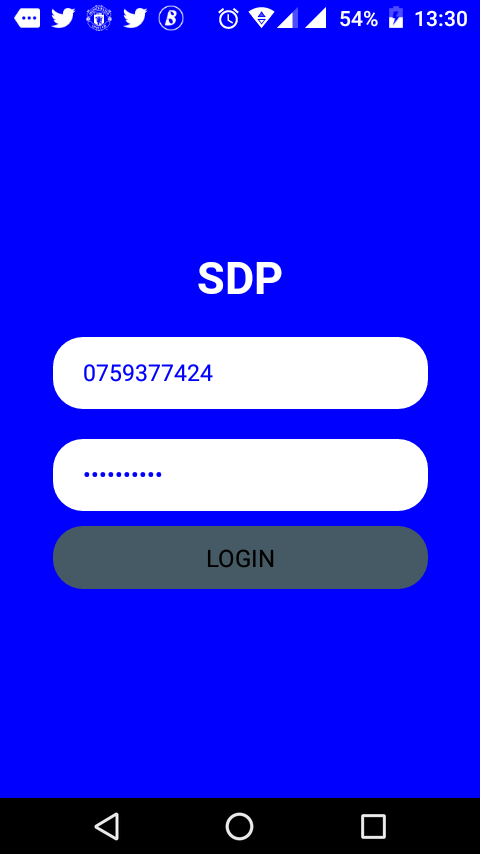

### Register Parcel Page

- You are required to fill all the fields ``NOTE`` For Catergory and Loaction click on select button to choose you choice
- Inputs with ``ERRORS`` will be highlighted in red & An alert will display
- Click ``Register Button`` to register the parcel a confirmation message wil be sent to the ``Sender ``
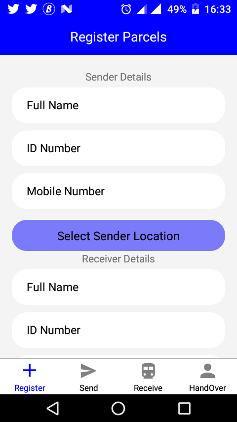

## Send Parcel Page

### Select ``Vehicle `` 
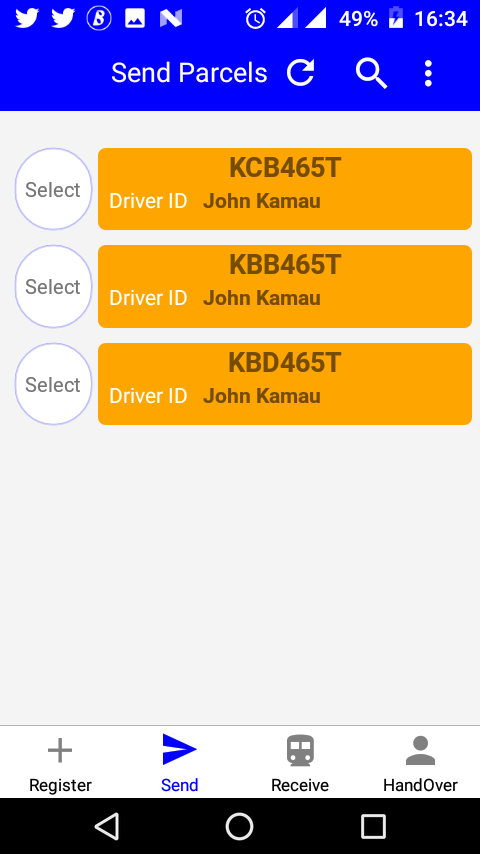	

### Select Parcels
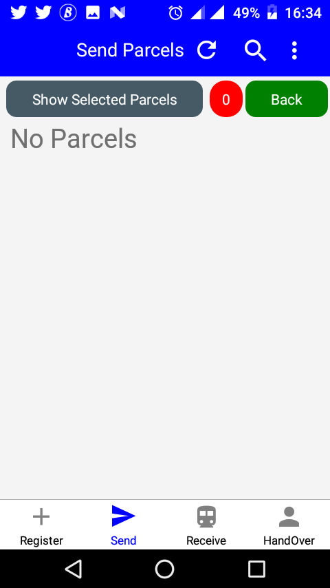

### Submit Parcels
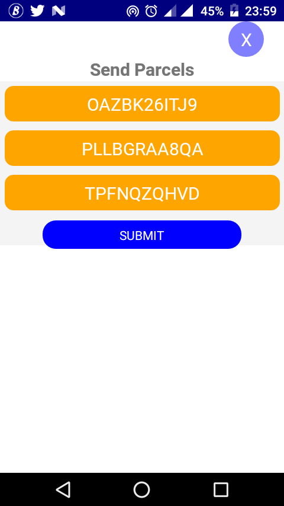

### Receive Page
- Click on select button``When you submit a message is automaticall send to the receiver``
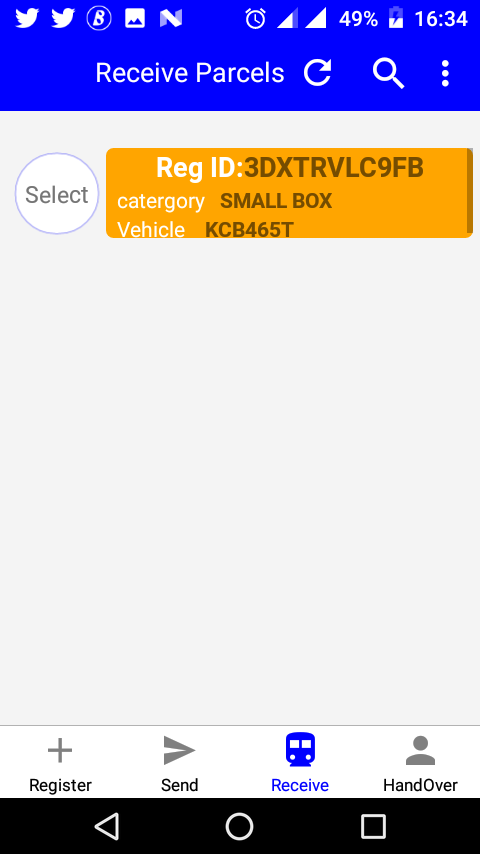

### Handover Page
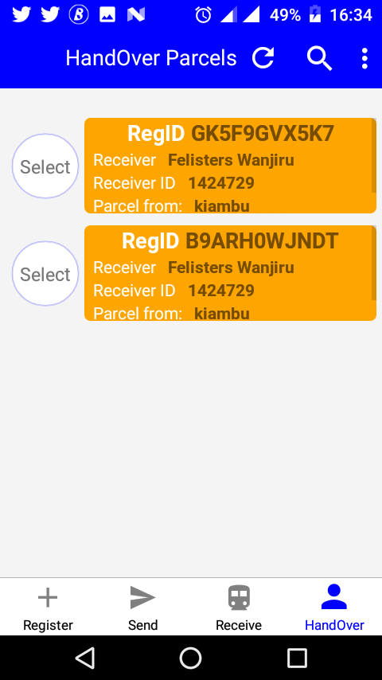

### Drawer
- Swipe to the left or Click the menu icon to access the drawer
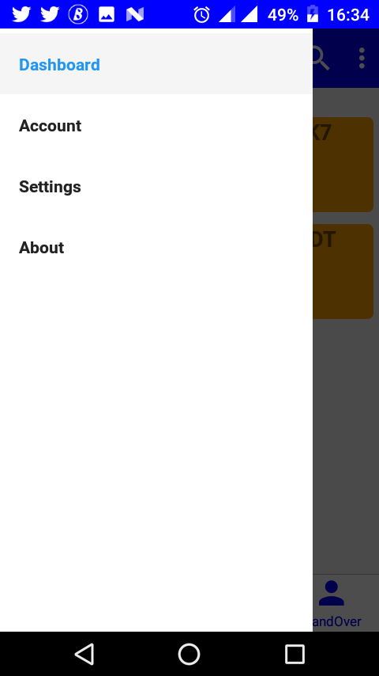

### Drawer Pages
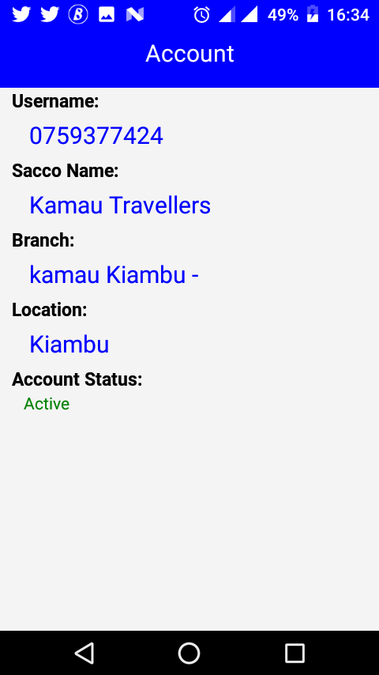 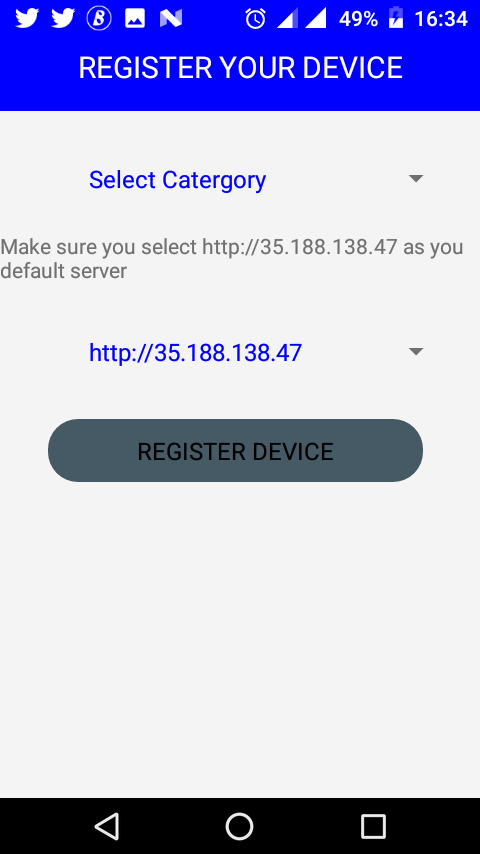 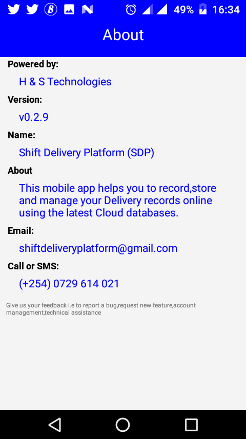
